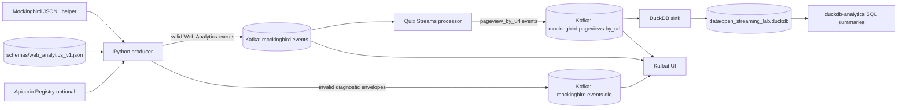

# Open Streaming Lab Architecture

Open Streaming Lab is a local, open-source streaming data lab that demonstrates the path from generated events to Kafka, validation, processing, persistence, and SQL analytics.

## Data flow

## Runtime services

| Service | URL / port | Purpose |
| --- | --- | --- |
| Apache Kafka | `127.0.0.1:9092` | Local broker for source, DLQ, and derived topics. |
| Kafbat UI | <http://localhost:8080> | Inspect topics, records, partitions, offsets, and consumer groups. |
| Apicurio Registry | <http://localhost:8081> | Optional open-source schema registry for the Web Analytics JSON Schema. |

## CLI components

| Command | Role | Main operational signal |
| --- | --- | --- |
| `kafka-admin` | Create/describe source, DLQ, and derived topics. | Topic existence, partition count, replica/isr metadata. |
| `kafka-produce` | Generate Mockingbird records, validate them, and publish to main or DLQ topics. | `seen`, `main`, `dlq`, `delivered`, `errors` summary. |
| `schema-registry` | Register/fetch JSON Schemas in Apicurio Registry. | Artifact id/type/version response. |
| `kafka-process` | Derive `pageview_by_url` events from valid source events with Quix Streams. | Derived event prints, Quix stop condition logs. |
| `kafka-sink-duckdb` | Persist derived pageviews into DuckDB. | Consumed count, before/after row count, idempotent delta. |
| `duckdb-analytics` | Run SQL summaries over local DuckDB data. | Pageview/session/user/referrer tables. |

## Why no Prometheus/Grafana yet?

The project now has useful local operational signals through CLI summaries, Kafka UI, Apicurio API responses, and DuckDB row/query outputs. Prometheus/Grafana would be open source, but adding it now would increase setup weight without teaching a new core streaming concept. Add it later when the project has long-running services or repeated load tests that justify scraped metrics and dashboards.

## Open-source posture

All runtime pieces are local/open-source:

- Apache Kafka instead of managed Kafka.
- Kafbat UI instead of proprietary Kafka UI SaaS.
- Apicurio Registry instead of Confluent Cloud Schema Registry.
- Quix Streams Python library for processing.
- DuckDB for local analytics.

No cloud credentials, managed services, or proprietary ingestion paths are required.
